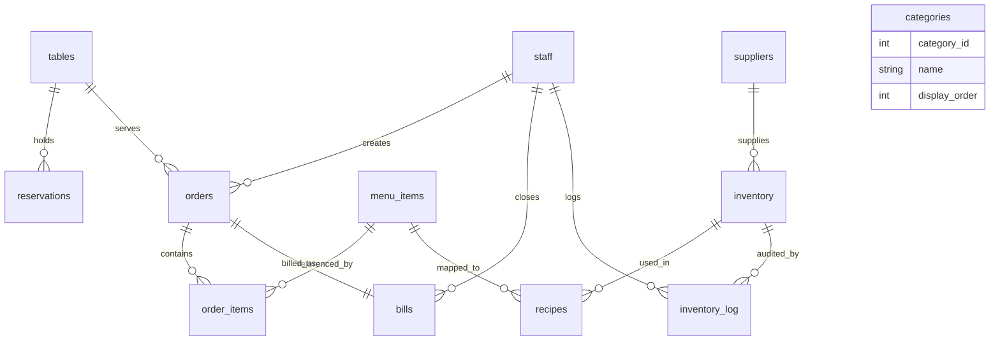

# Go Eats Food

Go Eats Food is a restaurant management system for order tracking, table management, billing, inventory control and sales analytics. The backend is a Flask + SQLAlchemy API, the database layer is normalized MySQL, and the frontend is a single-page dark UI served from the Flask app.

## Project Structure

- `backend/` - Flask app, SQLAlchemy models, route blueprints and environment config
- `database/` - MySQL schema and seed scripts
- `frontend/` - SPA shell, views, styles and reusable components
- `README.md` - setup and API reference

## Setup

### 1. Create the database

```sql
mysql -u root -p < database/schema.sql
mysql -u root -p goeats_food < database/seed.sql
```

If you prefer to run the statements manually, import `database/schema.sql` first and then `database/seed.sql`.

### 2. Configure environment variables

Copy `backend/.env.example` to `backend/.env` and adjust the MySQL credentials.

Recommended values:

```env
DB_DRIVER=mysql+pymysql
DB_HOST=127.0.0.1
DB_PORT=3306
DB_USER=root
DB_PASSWORD=your_password
DB_NAME=goeats_food
AUTO_CREATE_TABLES=0
DEFAULT_USER_ROLE=admin
PORT=5000
```

### 3. Install Python dependencies

```bash
pip install -r backend/requirements.txt
```

### 4. Start the app

```bash
python backend/app.py
```

Open `http://localhost:5000` to load the SPA.

## API Overview

Base URL: `/api`

### Orders

- `GET /api/orders` - list orders with `status`, `table_id`, `start_date`, `end_date` filters
- `POST /api/orders` - create a new order with multiple line items
- `PUT /api/orders/:id/status` - update order status and trigger inventory deduction on `served`
- `GET /api/orders/:id/bill` - compute the bill totals for an order

### Billing

- `GET /api/bills` - list recent bills
- `GET /api/bills/:id` - get a single bill
- `POST /api/bills` - finalize a bill, mark the order billed and release the table

### Tables and Reservations

- `GET /api/tables` - list all tables with current live context
- `PUT /api/tables/:id` - update table status
- `POST /api/reservations` - create a reservation
- `POST /api/tables/merge` - merge multiple tables into a target table

### Inventory

- `GET /api/inventory` - list inventory items with stock status
- `PUT /api/inventory/:id` - restock an item
- `GET /api/inventory/logs` - recent audit log entries

### Reports

- `GET /api/reports/daily` - daily sales summary and totals
- `GET /api/reports/weekly` - 7-day revenue trend
- `GET /api/reports/hourly` - hourly revenue data
- `GET /api/reports/top-items` - top 5 items by order volume
- `GET /api/reports/category-breakdown` - revenue split by category

### Catalog and Admin

- `GET /api/menu-items` - menu catalog for order creation
- `GET /api/staff` - staff list
- `GET /api/suppliers` - supplier list
- `GET /api/categories` - category list
- `POST /api/admin/menu-items` - create a menu item
- `PUT /api/admin/menu-items/:id` - update a menu item
- `POST /api/admin/staff` - create staff
- `PUT /api/admin/staff/:id` - update staff
- `POST /api/admin/suppliers` - create supplier
- `PUT /api/admin/suppliers/:id` - update supplier

## ER Diagram



## Functional Notes

- Orders support multiple line items and status transitions.
- Inventory is auto-deducted when an order moves to `served`.
- Bills compute GST at 5% and service charge at 2%.
- The frontend polls the API every 15 seconds for live updates.
- The app ships with a dark, responsive dashboard layout and custom div-based charts.
- Role-based checks are enforced through the `X-User-Role` header; the app defaults to `admin` for local development.

## Screenshots

Capture screenshots from the live app and place them under `frontend/screenshots/`.

Recommended set:

- Dashboard overview
- Order management
- Table management
- Billing and receipt view
- Inventory alerts
- Reports and analytics
- Admin panel

## Seed Data

The seed file creates:

- 15 tables
- 20 menu items
- 5 staff members
- 12 inventory items
- 5 orders with line items
- sample reservations, recipes, bills and inventory log entries

## Validation

The Flask app, ORM models, route modules and frontend scripts were validated for syntax after generation.
